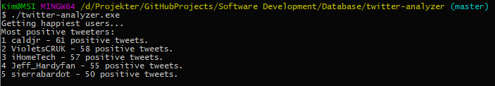

# Assignment 2 - Analysis of Twitter Data

Made by Kim Meyer Albrechtsen

Made with [go](https://golang.org/).

The MongoDB database runs on a server on DigitalOcean. So all the Twitter data is in there. No need for setting this up locally.

## Asnwers

### 1. How many Twitter users are in the database?

___

### 2. Which Twitter users link the most to other Twitter users? (Provide the top ten.)

___

### 3. Who is are the most mentioned Twitter users? (Provide the top five.)

___

### 4. Who are the most active Twitter users (top ten)?

___

### 5. Who are the five most grumpy (most negative tweets) and the most happy (most positive tweets)? (Provide five users for each group)
**Grumpiest:**


**Happiest:**

___


## How to use the program

### Prerequisites
1. You need to have go installed in order to run this program.

2. The program is using [mgo](https://labix.org/mgo). You have to install this to run this program. Do it in the terminal with the command:
```
$ go get gopkg.in/mgo.v2
``` 

### Building and running the program
1. First clone this project on a location on your computer:
```
$ git clone https://github.com/KIMB0/twitter-data-analysis.git
```
2. In the code, uncomment the method you need. Use one method at a time.

3. Navigate to the project folder and run:
```
$ go build
```
4. Now to rund the program use:
```
$ ./twitter_analyze
```

You will then get the result in the terminal.